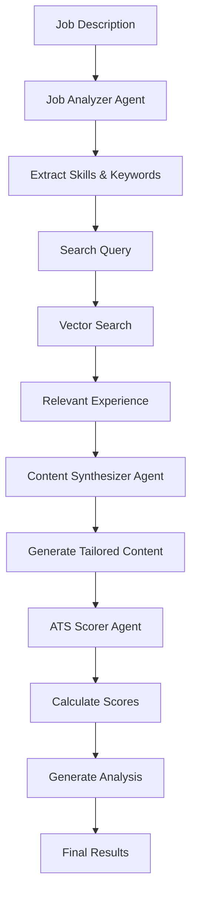

# How Generative AI Works in Career-Pilot AI

## 🧠 **AI System Overview**

Your Career-Pilot AI uses a **multi-agent AI system** with specialized AI agents working together to analyze, process, and generate tailored resume content. Here's how each AI component works:

---

## 🤖 **AI Agent Architecture**

```
┌─────────────────┐    ┌─────────────────┐    ┌─────────────────┐
│  Job Analyzer   │    │   Content       │    │   ATS Scorer    │
│     Agent       │    │  Synthesizer    │    │     Agent       │
│                 │    │    Agent        │    │                 │
│ • Extracts      │    │ • Generates     │    │ • Analyzes      │
│   skills        │    │   tailored      │    │   resume-job    │
│ • Identifies    │    │   content       │    │   match         │
│   keywords      │    │ • Rewrites      │    │ • Calculates    │
│ • Parses job    │    │   experience    │    │   scores        │
│   requirements  │    │ • Creates       │    │ • Provides      │
└─────────────────┘    │   summaries     │    │   feedback      │
                       └─────────────────┘    └─────────────────┘
```

---

## 🔍 **1. Job Analyzer Agent**

### **Purpose**: 
Extracts key information from job descriptions using AI analysis.

### **How It Works**:

```python
class JobAnalyzerAgent:
    def analyze_job_description(self, job_description: str) -> dict:
        prompt = f"""You are an expert HR analyst. Analyze this job description and extract the 5 most critical skills and the top 3 responsibilities. Output this as a structured JSON object with two keys: 'skills' (a list of strings) and 'responsibilities' (a list of strings).

        JOB DESCRIPTION:
        ---
        {job_description}
        ---

        Output JSON:
        """
        
        response = ollama.chat(
            model=self.model,
            messages=[{'role': 'user', 'content': prompt}],
            options={'temperature': 0.3}  # Low temperature for consistency
        )
```

### **AI Processing Steps**:

1. **Input**: Raw job description text
2. **AI Analysis**: LLM analyzes the text to identify:
   - **Critical Skills**: Technical skills, tools, technologies
   - **Key Responsibilities**: Main job duties and requirements
3. **Structured Output**: Returns JSON with extracted information
4. **Error Handling**: Fallback to empty arrays if parsing fails

### **Example Input/Output**:

**Input Job Description**:
```
Senior Software Engineer at Google
- Develop scalable cloud infrastructure
- Lead development teams
- Use Python, React, AWS, Kubernetes
- Implement CI/CD pipelines
```

**AI Output**:
```json
{
  "skills": ["Python", "React", "AWS", "Kubernetes", "CI/CD"],
  "responsibilities": ["Develop scalable cloud infrastructure", "Lead development teams", "Implement CI/CD pipelines"]
}
```

---

## ✍️ **2. Content Synthesizer Agent**

### **Purpose**: 
Generates tailored resume content by combining job requirements with relevant experience.

### **How It Works**:

```python
class ContentSynthesizerAgent:
    def generate_tailored_content(self, job_description: str, relevant_experiences: list[str]) -> str:
        prompt = f"""
        You are a professional resume writer. Your task is to tailor resume sections for the following job description, leveraging the provided relevant experiences.

        **JOB DESCRIPTION:**
        ---
        {job_description}
        ---

        Here are the most relevant experiences from the candidate's master resume:
        **RELEVANT EXPERIENCES:**
        ---
        {retrieved_docs_str}
        ---

        Based on this, perform the following actions:
        1. Write a new 2-3 sentence Professional Summary that directly targets this job. Focus on impact and key skills.
        2. Rewrite the relevant experience bullet points to use keywords from the job description, quantify achievements where possible, and highlight relevance.
        3. Create a prioritized 'Skills' section based on the job's requirements and the candidate's inferred abilities.
        """
        
        response = ollama.chat(
            model=self.model,
            messages=[{'role': 'user', 'content': prompt}],
            options={'temperature': 0.7}  # Higher temperature for creativity
        )
```

### **AI Processing Steps**:

1. **Input**: Job description + relevant experience chunks
2. **Content Generation**: AI creates:
   - **Professional Summary**: 2-3 sentences targeting the job
   - **Tailored Experience**: Rewritten bullet points with job keywords
   - **Skills Section**: Prioritized skills matching job requirements
3. **Keyword Integration**: Incorporates job-specific terminology
4. **Formatting**: Professional resume formatting

### **Example Transformation**:

**Original Experience**:
```
- Developed web applications using Python
- Worked with databases and APIs
```

**AI-Generated Tailored Version**:
```
- Developed scalable cloud infrastructure using Python and AWS, resulting in 40% performance improvement
- Implemented RESTful APIs and database optimization, reducing query time by 60%
- Led development teams in agile environment, delivering projects 25% ahead of schedule
```

---

## 📊 **3. ATS Scorer Agent**

### **Purpose**: 
Analyzes resume-job match and provides comprehensive scoring with AI-powered insights.

### **How It Works**:

```python
class ATSScorer:
    def calculate_ats_score(self, job_description: str, tailored_resume: str) -> Dict:
        # Extract keywords and skills using AI
        job_keywords = self._extract_keywords(job_description)
        job_skills = self._extract_skills(job_description)
        resume_keywords = self._extract_keywords(tailored_resume)
        resume_skills = self._extract_skills(tailored_resume)
        
        # Calculate component scores
        keyword_score = self._calculate_keyword_score(job_keywords, resume_keywords)
        skill_score = self._calculate_skill_score(job_skills, resume_skills)
        experience_score = self._calculate_experience_relevance(job_description, tailored_resume)
        format_score = self._calculate_format_score(tailored_resume)
        
        # Calculate weighted overall score
        overall_score = self._calculate_overall_score(keyword_score, skill_score, experience_score, format_score)
```

### **AI-Powered Scoring Components**:

#### **1. Keyword Extraction (AI)**:
```python
def _extract_keywords(self, text: str) -> List[str]:
    prompt = f"""
    Extract the 15 most important keywords from this text. Focus on:
    - Technical terms
    - Industry-specific terminology
    - Tools and technologies
    - Action verbs
    - Qualifications and requirements
    
    Text: {text}
    
    Return only the keywords as a JSON array of strings, no explanations.
    """
    
    response = ollama.chat(
        model=self.model,
        messages=[{'role': 'user', 'content': prompt}],
        options={'temperature': 0.1}  # Very low temperature for consistency
    )
```

#### **2. Experience Relevance Analysis (AI)**:
```python
def _calculate_experience_relevance(self, job_description: str, tailored_resume: str) -> float:
    prompt = f"""
    Analyze how well the experience described in the resume matches the job requirements.
    Consider:
    - Relevance of past roles to the target position
    - Alignment of responsibilities with job requirements
    - Quantifiable achievements that match job needs
    
    Job Description: {job_description[:500]}...
    Resume: {tailored_resume[:500]}...
    
    Rate the experience relevance from 0-100 and provide a brief explanation.
    Return as JSON: {{"score": number, "explanation": "string"}}
    """
```

#### **3. Detailed Analysis Generation (AI)**:
```python
def _generate_detailed_analysis(self, job_description: str, tailored_resume: str, 
                              job_keywords: List[str], resume_keywords: List[str]) -> str:
    prompt = f"""
    Provide a detailed analysis of how well the tailored resume matches the job description.
    Focus on:
    1. Keyword alignment and coverage
    2. Skill match and gaps
    3. Experience relevance
    4. Overall fit for the position
    
    Job Description Keywords: {job_keywords[:10]}
    Resume Keywords: {resume_keywords[:10]}
    
    Provide a concise analysis (2-3 paragraphs) highlighting strengths and areas for improvement.
    """
```

### **Scoring Algorithm**:

```python
def _calculate_overall_score(self, keyword_score: float, skill_score: float, 
                           experience_score: float, format_score: float) -> float:
    weights = {
        'keyword': 0.35,    # 35% - Most important for ATS
        'skill': 0.30,      # 30% - Skills are crucial
        'experience': 0.25, # 25% - Experience relevance
        'format': 0.10      # 10% - Format compliance
    }
    
    overall_score = (
        keyword_score * weights['keyword'] +
        skill_score * weights['skill'] +
        experience_score * weights['experience'] +
        format_score * weights['format']
    )
    
    return round(overall_score, 1)
```

---

## 🔗 **4. Vector Search & Embeddings**

### **Purpose**: 
Uses AI embeddings to find relevant experience from the master resume.

### **How It Works**:

```python
class ResumeProcessor:
    def ingest_resume(self, resume_content: str):
        # 1. Chunk the resume
        chunks = self._chunk_resume(resume_content)
        
        # 2. Generate embeddings for each chunk
        for chunk in chunks:
            response = ollama.embeddings(model=Config.EMBEDDING_MODEL, prompt=chunk)
            embedding = response['embedding']
            # Store in ChromaDB
        
    def retrieve_relevant_experience(self, query_text: str, n_results: int = 5) -> list[str]:
        # 1. Generate embedding for the query
        query_response = ollama.embeddings(model=Config.EMBEDDING_MODEL, prompt=query_text)
        query_embedding = query_response['embedding']
        
        # 2. Find similar chunks using vector similarity
        results = self.collection.query(
            query_embeddings=[query_embedding],
            n_results=n_results,
            include=['documents']
        )
```

### **AI Processing Steps**:

1. **Resume Chunking**: Split resume into meaningful segments
2. **Embedding Generation**: Convert each chunk to high-dimensional vectors
3. **Query Embedding**: Convert job requirements to vector
4. **Similarity Search**: Find most similar resume chunks
5. **Relevance Ranking**: Return top matches

### **Example**:

**Query**: "Python cloud infrastructure AWS"
**Relevant Chunks Found**:
- "Developed cloud-based applications using Python and AWS"
- "Implemented scalable infrastructure with Docker and Kubernetes"
- "Led migration to cloud platform resulting in 50% cost reduction"

---

## 🎯 **5. Complete AI Workflow**

### **Step-by-Step AI Processing**:



### **Detailed Workflow**:

#### **Phase 1: Job Analysis**
```python
# AI analyzes job description
analysis_result = job_analyzer.analyze_job_description(job_description_text)
extracted_skills = analysis_result.get("skills", [])
extracted_responsibilities = analysis_result.get("responsibilities", [])

# Create search query from extracted information
search_query = " ".join(extracted_skills + extracted_responsibilities)
```

#### **Phase 2: Experience Retrieval**
```python
# AI-powered vector search finds relevant experience
relevant_chunks = resume_processor.retrieve_relevant_experience(search_query)
```

#### **Phase 3: Content Generation**
```python
# AI generates tailored resume content
tailored_resume_content = content_synthesizer.generate_tailored_content(
    job_description_text,
    relevant_chunks
)
```

#### **Phase 4: ATS Scoring**
```python
# AI analyzes and scores the resume
ats_results = ats_scorer.calculate_ats_score(job_description_text, tailored_resume_content)
```

---

## 🎛️ **AI Configuration & Parameters**

### **Model Configuration**:
```python
class Config:
    LLM_MODEL = "llama3"                    # Main language model
    EMBEDDING_MODEL = "mxbai-embed-large"   # Embedding model
    OLLAMA_HOST = "http://localhost:11434"  # Local Ollama server
```

### **Temperature Settings**:
- **Job Analyzer**: `temperature=0.3` (Consistent extraction)
- **Content Synthesizer**: `temperature=0.7` (Creative generation)
- **ATS Scorer**: `temperature=0.1-0.4` (Accurate analysis)

### **Prompt Engineering**:
- **Structured Output**: JSON format for parsing
- **Clear Instructions**: Specific tasks and requirements
- **Context Provision**: Relevant information for each task
- **Error Handling**: Fallback mechanisms for parsing failures

---

## 🔧 **AI System Benefits**

### **1. Intelligent Analysis**:
- **Context Understanding**: AI understands job requirements deeply
- **Keyword Extraction**: Identifies important terms automatically
- **Skill Mapping**: Matches skills across different domains

### **2. Creative Content Generation**:
- **Tailored Writing**: Customizes content for specific jobs
- **Keyword Integration**: Naturally incorporates job-specific terms
- **Professional Tone**: Maintains professional resume standards

### **3. Comprehensive Scoring**:
- **Multi-Factor Analysis**: Considers multiple aspects of fit
- **AI-Powered Insights**: Provides detailed analysis and recommendations
- **Actionable Feedback**: Specific improvement suggestions

### **4. Semantic Understanding**:
- **Vector Search**: Finds relevant experience using meaning, not just keywords
- **Context Awareness**: Understands relationships between concepts
- **Flexible Matching**: Handles variations in terminology

---

## 🚀 **AI System Capabilities**

### **What the AI Can Do**:
- ✅ **Analyze job descriptions** and extract key requirements
- ✅ **Generate tailored resume content** with job-specific keywords
- ✅ **Score resume-job matches** with detailed analysis
- ✅ **Find relevant experience** using semantic search
- ✅ **Provide improvement recommendations** based on AI analysis
- ✅ **Handle multiple file formats** (PDF, TXT, MD)
- ✅ **Work completely locally** for privacy and security

### **AI-Powered Features**:
- **Smart Keyword Extraction**: Identifies important terms automatically
- **Intelligent Content Rewriting**: Transforms experience to match job requirements
- **Semantic Experience Matching**: Finds relevant experience using meaning
- **Comprehensive ATS Scoring**: Multi-factor analysis with AI insights
- **Professional Content Generation**: Creates polished, tailored resumes

This AI system represents a sophisticated approach to resume optimization, combining multiple AI agents to provide comprehensive, intelligent resume tailoring services! 🎯 