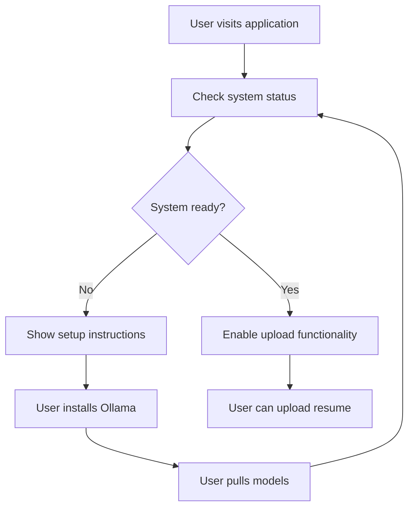
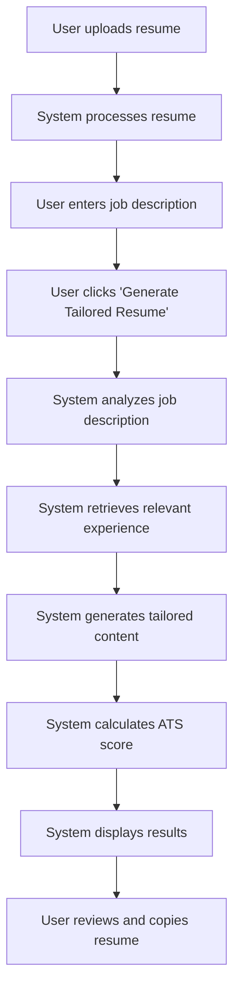
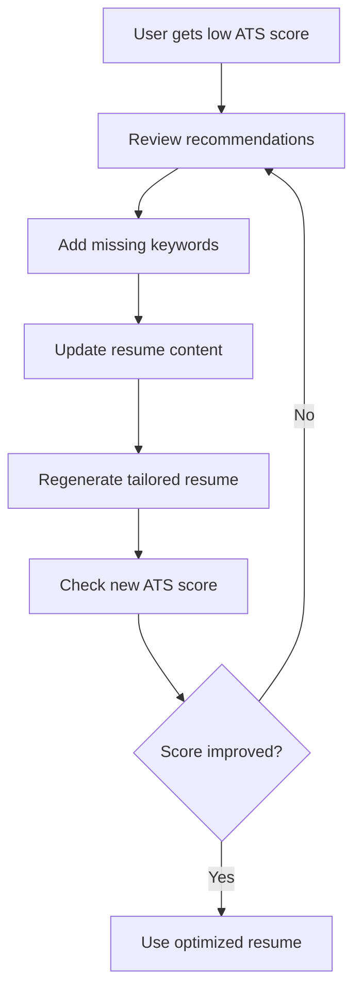

# Career-Pilot AI: Functional Documentation

## Table of Contents
1. [Product Overview](#product-overview)
2. [User Personas](#user-personas)
3. [User Stories](#user-stories)
4. [Feature Specifications](#feature-specifications)
5. [User Workflows](#user-workflows)
6. [Business Logic](#business-logic)
7. [ATS Scoring Methodology](#ats-scoring-methodology)
8. [Use Cases](#use-cases)
9. [Success Metrics](#success-metrics)
10. [Future Roadmap](#future-roadmap)

---

## Product Overview

### Vision Statement
Career-Pilot AI is a **local-first, AI-powered resume optimization platform** that helps job seekers create tailored resumes that pass ATS (Applicant Tracking System) screening and increase their chances of landing interviews.

### Mission
To democratize access to professional resume optimization by providing AI-powered tools that work locally, ensuring privacy and eliminating subscription costs.

### Value Proposition
- **Privacy-First**: All processing happens locally, no data leaves your machine
- **AI-Powered**: Advanced language models for intelligent resume tailoring
- **ATS-Optimized**: Comprehensive scoring to ensure ATS compatibility
- **Cost-Effective**: One-time setup, no recurring fees
- **Professional Quality**: Enterprise-grade resume optimization

---

## User Personas

### Primary Persona: Active Job Seeker
**Name**: Sarah, 28, Software Engineer
- **Goals**: Land interviews at top tech companies
- **Pain Points**: Resumes getting rejected by ATS, generic applications
- **Tech Comfort**: High - comfortable with local software installation
- **Time Constraints**: Limited time for manual resume optimization

### Secondary Persona: Career Changer
**Name**: Mike, 35, Marketing Manager → Data Analyst
- **Goals**: Transition to new field, highlight transferable skills
- **Pain Points**: Unclear how to present relevant experience
- **Tech Comfort**: Medium - needs clear setup instructions
- **Time Constraints**: Learning new field while job searching

### Tertiary Persona: Recent Graduate
**Name**: Alex, 22, Computer Science Graduate
- **Goals**: Get first professional job, stand out from competition
- **Pain Points**: Limited experience, unsure what employers want
- **Tech Comfort**: High - grew up with technology
- **Time Constraints**: Applying to many positions quickly

---

## User Stories

### Epic 1: Resume Upload and Processing
**As a job seeker, I want to upload my resume so that the system can analyze and process it for optimization.**

#### User Stories:
- **US-001**: As a user, I want to drag and drop my resume file so that I can easily upload it
- **US-002**: As a user, I want to see upload progress so that I know the system is working
- **US-003**: As a user, I want to upload PDF files so that I can use my existing resume format
- **US-004**: As a user, I want validation feedback so that I know if my file is supported

### Epic 2: Job Description Analysis
**As a job seeker, I want to input job descriptions so that the system can understand what employers are looking for.**

#### User Stories:
- **US-005**: As a user, I want to paste job descriptions so that I can target specific positions
- **US-006**: As a user, I want to see the system analyzing the job so that I know it's working
- **US-007**: As a user, I want to edit job descriptions so that I can refine the targeting

### Epic 3: Resume Tailoring
**As a job seeker, I want my resume automatically tailored so that it matches the job requirements.**

#### User Stories:
- **US-008**: As a user, I want AI-generated tailored content so that my resume is optimized
- **US-009**: As a user, I want to see the tailoring process so that I understand what's happening
- **US-010**: As a user, I want professional formatting so that my resume looks polished

### Epic 4: ATS Scoring
**As a job seeker, I want to see how well my resume matches the job so that I can improve it.**

#### User Stories:
- **US-011**: As a user, I want an overall ATS score so that I know my resume's effectiveness
- **US-012**: As a user, I want detailed score breakdown so that I understand areas for improvement
- **US-013**: As a user, I want specific recommendations so that I know how to improve my resume
- **US-014**: As a user, I want to see missing keywords so that I can add them to my resume

### Epic 5: Results Management
**As a job seeker, I want to easily access and copy my tailored resume so that I can use it for applications.**

#### User Stories:
- **US-015**: As a user, I want to copy my resume to clipboard so that I can paste it elsewhere
- **US-016**: As a user, I want to see the final formatted resume so that I can review it
- **US-017**: As a user, I want to compare original vs tailored so that I can see improvements

---

## Feature Specifications

### 1. Resume Upload System

#### Functional Requirements:
- **Supported Formats**: PDF, TXT, MD
- **File Size Limit**: 10MB maximum
- **Validation**: File type and content validation
- **Processing**: Text extraction and chunking

#### Technical Specifications:
```python
# File Validation
allowed_extensions = ['.pdf', '.txt', '.md']
max_file_size = 10 * 1024 * 1024  # 10MB

# Processing Pipeline
1. File upload → 2. Format validation → 3. Text extraction → 
4. Content validation → 5. Chunking → 6. Embedding generation → 
7. ChromaDB storage
```

#### User Interface:
- Drag and drop upload area
- File browser option
- Progress indicator
- Success/error feedback
- File preview

### 2. Job Description Input

#### Functional Requirements:
- **Text Input**: Large textarea for job descriptions
- **Character Limit**: 10,000 characters
- **Real-time Validation**: Content length checking
- **Placeholder Text**: Example job description

#### Technical Specifications:
```python
# Input Validation
min_length = 50
max_length = 10000
required_fields = ['text']

# Processing
1. Text input → 2. Length validation → 3. Content analysis → 
4. Keyword extraction → 5. Skill identification
```

#### User Interface:
- Large textarea with placeholder
- Character counter
- Real-time validation
- Clear button
- Example job description

### 3. AI Resume Tailoring

#### Functional Requirements:
- **Content Generation**: AI-powered resume sections
- **Keyword Optimization**: Job-specific keyword integration
- **Format Preservation**: Professional formatting
- **Experience Matching**: Relevant experience highlighting

#### Technical Specifications:
```python
# Tailoring Process
1. Job analysis → 2. Experience retrieval → 3. Content synthesis → 
4. Formatting → 5. Quality check

# Content Sections
- Professional Summary
- Relevant Experience
- Skills Section
- Optional: Education, Certifications
```

#### User Interface:
- Progress indicator during processing
- Real-time status updates
- Final formatted output
- Copy to clipboard functionality

### 4. ATS Scoring System

#### Functional Requirements:
- **Multi-Factor Scoring**: 4-component scoring system
- **Visual Feedback**: Score bars and charts
- **Detailed Analysis**: Component breakdown
- **Recommendations**: Actionable improvement tips

#### Technical Specifications:
```python
# Scoring Components
keyword_score = calculate_keyword_match(job_keywords, resume_keywords)
skill_score = calculate_skill_alignment(job_skills, resume_skills)
experience_score = calculate_experience_relevance(job_desc, resume)
format_score = calculate_format_compliance(resume)

# Weighted Overall Score
overall_score = (
    keyword_score * 0.35 +
    skill_score * 0.30 +
    experience_score * 0.25 +
    format_score * 0.10
)
```

#### User Interface:
- Overall score display
- Individual score bars
- Detailed analysis section
- Recommendations list
- Missing keywords display

---

## User Workflows

### Workflow 1: First-Time User Setup



**Steps:**
1. User opens application
2. System checks Ollama status
3. If not ready, shows setup instructions
4. User installs Ollama and required models
5. System enables full functionality

### Workflow 2: Resume Tailoring Process



**Steps:**
1. Upload resume (PDF/TXT/MD)
2. Enter job description
3. Generate tailored resume
4. Review ATS score and analysis
5. Copy optimized resume

### Workflow 3: Resume Improvement Cycle



**Steps:**
1. Review ATS score breakdown
2. Identify missing keywords
3. Update resume content
4. Regenerate tailored version
5. Iterate until desired score

---

## Business Logic

### 1. Resume Processing Logic

#### Chunking Algorithm:
```python
def chunk_resume(content: str) -> List[str]:
    # Split by lines
    lines = content.split('\n')
    
    # Filter meaningful chunks
    chunks = []
    for line in lines:
        line = line.strip()
        if len(line) > 10:  # Minimum meaningful length
            chunks.append(line)
    
    return chunks
```

#### Embedding Strategy:
- **Model**: mxbai-embed-large for quality embeddings
- **Chunking**: Line-based with minimum length filter
- **Storage**: ChromaDB for efficient similarity search

### 2. Job Analysis Logic

#### Keyword Extraction:
```python
def extract_keywords(text: str) -> List[str]:
    # AI-powered keyword extraction
    prompt = f"Extract 15 most important keywords from: {text}"
    response = llm.generate(prompt)
    
    # Parse JSON response
    keywords = json.loads(response)
    return [kw.lower() for kw in keywords]
```

#### Skill Identification:
- Technical skills (programming languages, tools)
- Soft skills (leadership, communication)
- Certifications and qualifications
- Industry-specific terminology

### 3. Content Generation Logic

#### Professional Summary:
```python
def generate_summary(job_desc: str, experience: List[str]) -> str:
    prompt = f"""
    Create a 2-3 sentence professional summary for a resume targeting:
    Job: {job_desc}
    Experience: {experience}
    
    Focus on:
    - Key achievements
    - Relevant skills
    - Career impact
    """
    return llm.generate(prompt)
```

#### Experience Rewriting:
- Highlight relevant achievements
- Use job-specific keywords
- Quantify results where possible
- Focus on transferable skills

### 4. ATS Scoring Logic

#### Keyword Matching:
```python
def calculate_keyword_score(job_keywords: List[str], resume_keywords: List[str]) -> float:
    job_set = set(job_keywords)
    resume_set = set(resume_keywords)
    
    # Exact matches
    exact_matches = job_set.intersection(resume_set)
    
    # Semantic matches (using embeddings)
    semantic_matches = find_semantic_matches(job_set, resume_set)
    
    total_matches = len(exact_matches) + len(semantic_matches)
    score = (total_matches / len(job_set)) * 100
    
    return min(score, 100.0)
```

#### Skill Alignment:
- Technical skill matching
- Soft skill comparison
- Bonus for additional relevant skills
- Penalty for missing critical skills

---

## ATS Scoring Methodology

### Scoring Components

#### 1. Keyword Match (35% Weight)
**Purpose**: Ensure resume contains job-specific terminology
**Calculation**:
- Extract keywords from job description
- Extract keywords from resume
- Calculate match percentage
- Include semantic similarity for related terms

**Scoring Criteria**:
- 90-100%: Excellent keyword coverage
- 80-89%: Good keyword coverage
- 70-79%: Fair keyword coverage
- Below 70%: Poor keyword coverage

#### 2. Skill Alignment (30% Weight)
**Purpose**: Match technical and soft skills with job requirements
**Calculation**:
- Identify required skills from job description
- Compare with skills listed in resume
- Award bonus for additional relevant skills
- Penalize missing critical skills

**Scoring Criteria**:
- 90-100%: Perfect skill match
- 80-89%: Strong skill alignment
- 70-79%: Moderate skill alignment
- Below 70%: Poor skill alignment

#### 3. Experience Relevance (25% Weight)
**Purpose**: Assess how well past experience matches job requirements
**Calculation**:
- AI-powered analysis of experience relevance
- Consider role similarity
- Evaluate achievement alignment
- Assess industry experience

**Scoring Criteria**:
- 90-100%: Highly relevant experience
- 80-89%: Relevant experience
- 70-79%: Somewhat relevant experience
- Below 70%: Limited relevant experience

#### 4. Format Compliance (10% Weight)
**Purpose**: Ensure resume format is ATS-friendly
**Calculation**:
- Check for required sections
- Validate content length
- Verify character encoding
- Assess formatting consistency

**Scoring Criteria**:
- 90-100%: Excellent ATS format
- 80-89%: Good ATS format
- 70-79%: Fair ATS format
- Below 70%: Poor ATS format

### Overall Score Calculation

```python
def calculate_overall_score(keyword_score, skill_score, experience_score, format_score):
    weights = {
        'keyword': 0.35,
        'skill': 0.30,
        'experience': 0.25,
        'format': 0.10
    }
    
    overall_score = (
        keyword_score * weights['keyword'] +
        skill_score * weights['skill'] +
        experience_score * weights['experience'] +
        format_score * weights['format']
    )
    
    return round(overall_score, 1)
```

### Score Interpretation

#### Excellent (90-100)
- Resume is highly optimized for ATS
- Strong keyword and skill alignment
- Relevant experience well-presented
- Professional formatting

#### Very Good (80-89)
- Resume is well-optimized
- Minor improvements possible
- Good overall alignment
- Ready for most applications

#### Good (70-79)
- Resume needs some optimization
- Missing some keywords or skills
- Experience could be better aligned
- Requires targeted improvements

#### Fair (60-69)
- Resume needs significant improvement
- Missing important keywords
- Skill gaps identified
- Experience needs better presentation

#### Poor (Below 60)
- Resume needs major restructuring
- Critical keywords missing
- Significant skill gaps
- Format issues present

---

## Use Cases

### Use Case 1: Software Engineer Applying to Tech Companies

**Scenario**: Sarah is a software engineer with 5 years of experience applying to senior positions at top tech companies.

**Input**:
- Resume: Senior Software Engineer with Python, React, AWS experience
- Job Description: Senior Software Engineer at Google focusing on cloud infrastructure

**Process**:
1. Upload current resume
2. Input Google job description
3. System generates tailored resume highlighting:
   - Cloud infrastructure experience
   - Scalable system design
   - Team leadership
   - Google-specific technologies

**Output**:
- Tailored resume with Google-specific keywords
- ATS Score: 92/100
- Recommendations: Add Kubernetes experience

### Use Case 2: Career Changer Transitioning to Data Science

**Scenario**: Mike is a marketing manager transitioning to data science roles.

**Input**:
- Resume: Marketing Manager with analytics experience
- Job Description: Data Scientist position requiring Python, SQL, ML

**Process**:
1. Upload marketing resume
2. Input data scientist job description
3. System identifies transferable skills:
   - Data analysis experience
   - Statistical knowledge
   - Project management
   - Stakeholder communication

**Output**:
- Resume reframed for data science
- ATS Score: 78/100
- Recommendations: Add Python projects, SQL experience

### Use Case 3: Recent Graduate Applying to First Job

**Scenario**: Alex is a computer science graduate applying to entry-level software developer positions.

**Input**:
- Resume: CS graduate with academic projects
- Job Description: Junior Developer at startup

**Process**:
1. Upload academic resume
2. Input startup job description
3. System highlights:
   - Relevant coursework
   - Project experience
   - Technical skills
   - Learning ability

**Output**:
- Professional resume format
- ATS Score: 85/100
- Recommendations: Add internship experience

---

## Success Metrics

### User Engagement Metrics
- **Upload Success Rate**: Percentage of successful resume uploads
- **Completion Rate**: Percentage of users who complete the full workflow
- **Return Usage**: Percentage of users who use the system multiple times
- **Session Duration**: Average time spent using the application

### Quality Metrics
- **ATS Score Improvement**: Average score increase after optimization
- **Interview Rate**: Percentage of users who report getting interviews
- **User Satisfaction**: Feedback scores and testimonials
- **Error Rate**: Percentage of failed processing attempts

### Technical Metrics
- **Processing Time**: Average time to generate tailored resume
- **System Uptime**: Application availability
- **Model Performance**: Accuracy of AI-generated content
- **Memory Usage**: System resource utilization

### Business Metrics
- **User Acquisition**: Number of new users
- **Retention Rate**: User retention over time
- **Feature Adoption**: Usage of different features
- **Support Requests**: Number of help requests

---

## Future Roadmap

### Phase 1: Core Enhancements (Q1 2024)
- **Multi-Language Support**: Support for different languages
- **Advanced PDF Processing**: Better handling of complex PDF formats
- **Template Library**: Pre-built resume templates
- **Export Options**: Multiple export formats (PDF, DOCX, HTML)

### Phase 2: Advanced Features (Q2 2024)
- **Cover Letter Generation**: AI-powered cover letter creation
- **Interview Preparation**: Mock interview questions based on resume
- **Salary Negotiation**: Salary range analysis and tips
- **Networking Tools**: LinkedIn profile optimization

### Phase 3: Enterprise Features (Q3 2024)
- **Team Collaboration**: Multi-user support for teams
- **Analytics Dashboard**: Detailed usage analytics
- **API Access**: REST API for third-party integrations
- **White-label Solution**: Customizable for organizations

### Phase 4: AI Advancements (Q4 2024)
- **Multi-Model Support**: Different LLMs for different tasks
- **Personalized Learning**: System learns from user preferences
- **Predictive Analytics**: Job market trend analysis
- **Career Path Planning**: Long-term career development guidance

### Long-term Vision (2025+)
- **Mobile Application**: Native iOS and Android apps
- **Real-time Collaboration**: Live editing and feedback
- **AI Career Coach**: Comprehensive career guidance system
- **Global Expansion**: Support for international job markets 